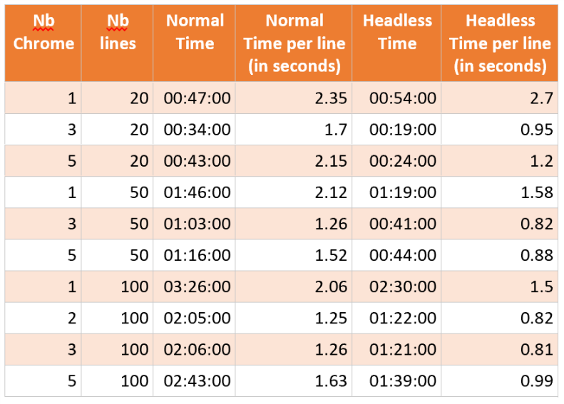

# Goal

This project is an experiment. The goal is to measure the efficiency of parallel run in RPA using Chrome to do automation on a remote website.

# Prerequirements

The software bellow has to be installed on your computer: - Microsoft Excel - Google Chrome - Visual Studio

# The process

The process is quite simple.
We have an Excel file containing lines with data.

The goal of the bot is to open a new instance of Chrome, go to a website containing a simple a simple form and fill it with the information from Excel.

If the form is successfully submitted, we set "OK" in the Excel file ; "KO" otherwise.

# The experiment

- The console application has been built using Tasks to do multithreading.
- Each lines of the file will be processed.
- When everything is finished, the console displays the time needed to completion.
- We'll also try to see if Chrome Headless is way more faster than with the UI.

# KPI

- Number of Chrome instances running
- Number of lines processed
- Time to completion

# Hardware

The tests are done on a computer with passive cooling and an intel core i5 with 2 cores.
For more information, check the specification of the Surface Book 2 13" in the cheapest model.

My internet connection is 1Gbits/sec down 500 Mbits up.

# Results

It appears that more Chrome running at the same time doesn't mean more performance.
This may be due to the fact that my computer is having only 2 cores.
More core you have, better your computer will be at multithreading.

Also, keep in mind that this test used an internet connection to contact a remote website. This means it is subject to lag and different response time from the server.

